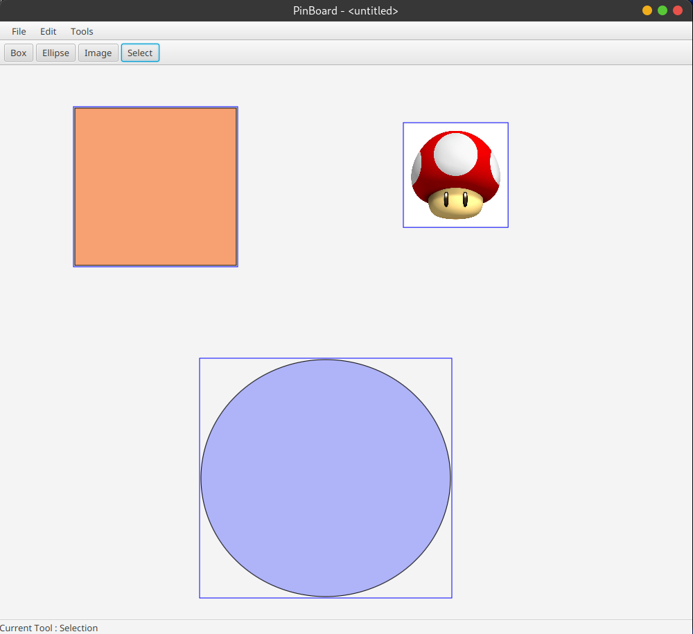

## Project description
The goal of the project is to develop a vector graphics editor, modeled after Adobe Illustrator or Inkscape. Of course, our editor will have only a very limited number of features. We compensate for this by emphasizing an extensible design, allowing for easy addition of functionalities. The editor's design will be based on principles of delegation, programming towards interfaces, and the use of some design patterns. For the graphical user interface (GUI), we will use the JavaFX API.

## Key features
Some key points include: 

- Separation between the document model (representation of the drawing as Java objects) and the graphical editing interface.
- Ability to open multiple windows simultaneously, each containing a different drawing.
- Toolbar, dropdown menus, color palette (as a bonus).
- Adding rectangles, ellipses, images (as a bonus).
- Selection tool, single or multiple.
- Moving, grouping, ungrouping elements.
- Copying and pasting with a shared clipboard between windows.
- Undo and redo actions up to an arbitrary level.
- Saving the drawing to a file and loading the file (as a bonus).

Our application will be named PinBoard, i.e., "pinboard," as it allows positioning and moving graphical elements (called clips) on a surface (called board).